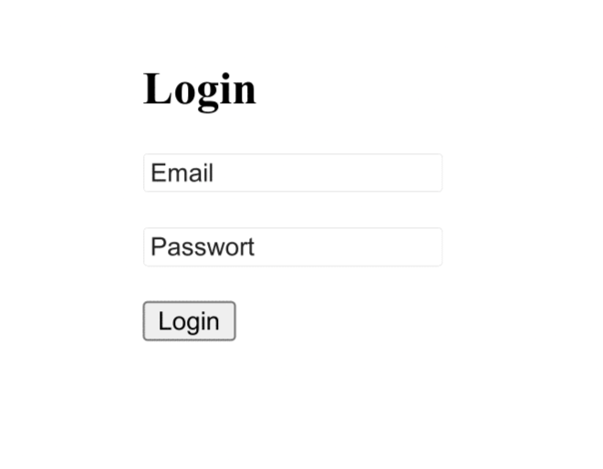
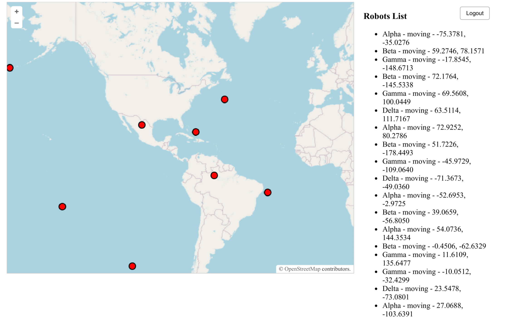

# Mini-Fleet Monitor for virtual Robots

A full-stack web application to monitor virtual robots in real-time. User can log in, view robot position on a map, and see live updates.

## Features

- User authentication with JWT
- Dashboard with OpenLayers map
- Live robot positions via WebSocket
- Simulation of robots moving every 2 seconds
- REST API + WebSocket Server
- PostgreSQL as persistent storage
- Redis for caching

## Stack

- **Backend:** Node.js, Express, PostgreSQL, Redis, WebSocket
- **Frontend:** React, OpenLayers
- **DevOps:** Docker + Docker Compose

## Setup

1. Close the repo:

```bash
git clone git@github.com:SandrZeus/MiniFleetMonitor.git
cd MiniFleetMonitor
```

2. Create a .env file (example):
```bash
VITE_PORT_BACKEND=4000
VITE_PORT=3333
REDIS_PORT=6379
REDIS_HOST=redis
DATABASE_URL=postgres://username:password@db:5432/minifleet
POSTGRES_USER=user
POSTGRES_PASSWORD=password
POSTGRES_DB=minifleet
ADMIN_EMAIL=admin@test.com
ADMIN_PASSWORD=test123
JWT=secret-key
```

3. Build and run Backend with Docker Compose:

```bash
docker-compose up --build
```

4. Start frontend manually:

```bash
cd frontend
npm install
npm run dev
```

## Screenshots

### Login Page

The login page allows user to authenticate with their email and password. After logging in, users are directed to the dashboard.

### Dashboard

The dashboard shows real-time positions of all robots on the map, live updates, status indicators, and positions. This is a protected page, therefore user can not access it without login.

